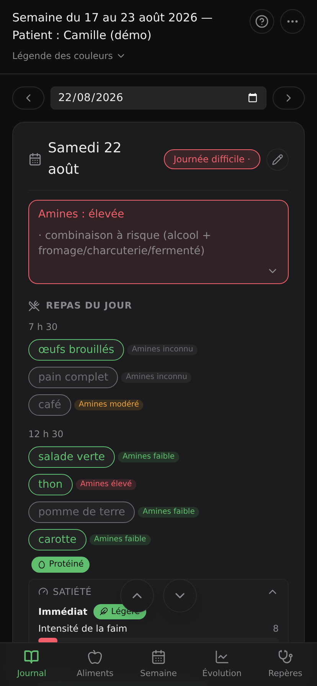
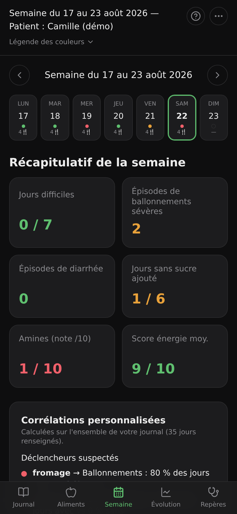
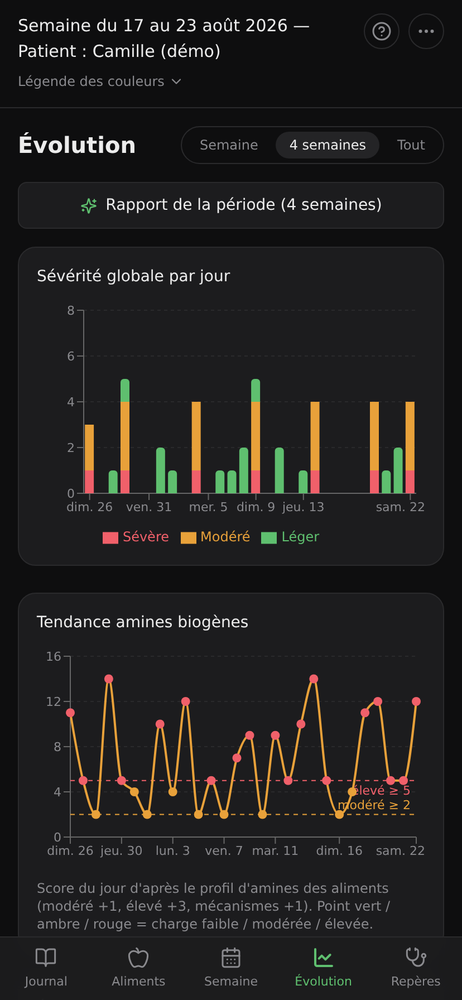
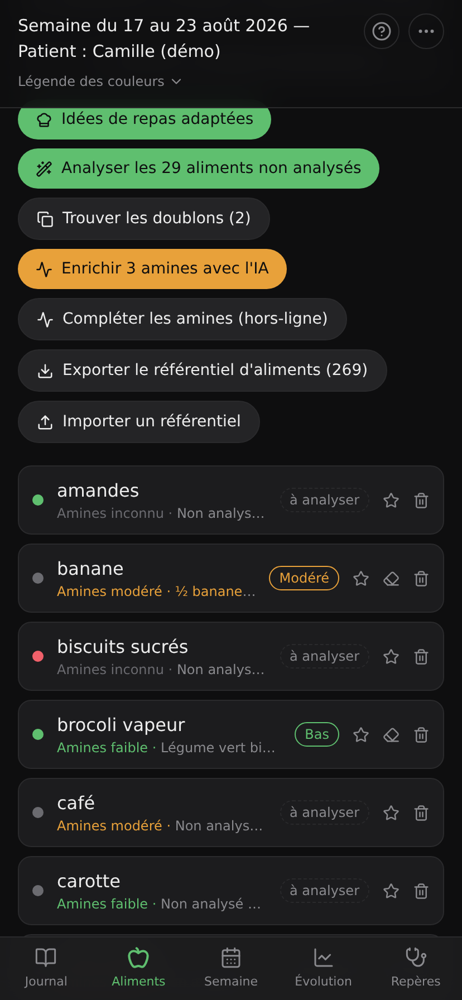
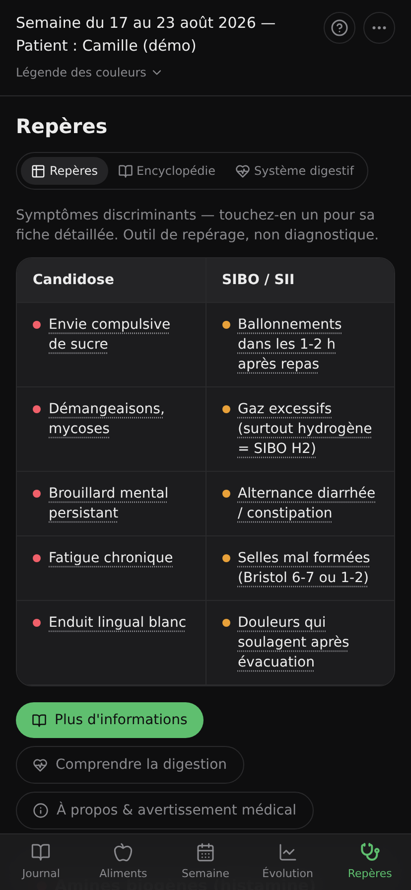

<div align="center">

# 🌿 Digestor

**Journal alimentaire & suivi des symptômes** pour la candidose intestinale, le SIBO et le SII.
PWA mobile-first, **100 % hors-ligne**, installable sur téléphone, déployable sur Netlify.

[](https://github.com/nouhailler/digestor/actions/workflows/ci.yml)
[](./LICENSE)


[](https://app.netlify.com/start/deploy?repository=https://github.com/nouhailler/digestor)

🔒 Toutes les données restent **sur l'appareil** (IndexedDB) — aucun backend, aucune API réseau obligatoire.

</div>

## 📸 Aperçu

<table>
  <tr>
    <td align="center"><b>📓 Journal</b><br></td>
    <td align="center"><b>🗓️ Semaine</b><br></td>
    <td align="center"><b>📈 Évolution</b><br></td>
  </tr>
  <tr>
    <td align="center"><b>🍎 Aliments</b><br></td>
    <td align="center"><b>🩺 Repères</b><br></td>
    <td></td>
  </tr>
</table>

## ✨ Fonctionnalités

- 📓 **Journal** — saisie jour par jour : repas (chips d'aliments auto-classés 🔴/🟢/⚪, catégorie
  modifiable d'un tap ; **une fois analysée par l'IA, la chip prend dynamiquement la couleur de sa
  sévérité FODMAP** 🔴 élevé / 🟠 modéré / 🟢 bas) avec **une zone de symptômes par repas** (pastilles
  d'intensité), notes,
  transit & hydratation (sélecteur de selles sur l'échelle de Bristol). **Autocomplétion** des
  aliments déjà saisis (dès 3 lettres) pour éviter les doublons d'orthographe, **favoris (★)
  proposés en tête**. **Quantité par aliment** (càc, càs, portion, g, ml… ou **juste un nombre**, ex.
  « 2 » œufs) qui pondère l'analyse.
  Badge « qualité de journée » 🟢→🟠→🔴 selon le cumul de symptômes, surchargeable. Infobulles
  d'aide. Sauvegarde auto.
- 🗓️ **Semaine** — **agenda cliquable** des 7 jours (couleur = qualité, clic → ouvre le jour) +
  récapitulatif calculé en direct (jours difficiles, ballonnements sévères, diarrhée, jours sans sucre
  ajouté, note amines /10, score énergie) + **corrélations** aliment → symptôme. **Corrélations
  personnalisées** calculées sur tout l'historique : déclencheurs suspectés (taux de symptôme les jours
  « avec » vs « sans ») et aliments fréquents bien tolérés — détection conservatrice, jamais inventée.
- 📈 **Évolution** — graphes sur semaine / 4 semaines / tout : sévérité par jour, symptômes après les
  repas (jour × heure), aliment suspect par symptôme, tendance des amines biogènes, selles (Bristol),
  catégories d'aliments, top symptômes, courbes de satiété, et la **synthèse des analyses IA de
  journées**. Plus un tableau de **récurrence des aliments** (30 derniers jours : mentions, jours
  distincts, rythme, plage de dates) et un **rapport de période** : tendances calculées
  (début vs fin) et **synthèse IA** optionnelle (verdict, déclencheurs récurrents, pistes).
- 🍎 **Aliments** *(IA, optionnel)* — analyse FODMAP (global + par groupe), verdicts SIBO & candidose,
  portion tolérée, conseils. **Catalogue de ~267 aliments**, **analyse en masse**, recherche combobox
  (préfixe ≥ 3 lettres), **idées de repas adaptées** (ajoutables au journal). Un aliment en cours
  d'analyse **remonte en haut de la liste** (badge « Génération… ») le temps de sa génération.
- 📷 **Scanner un produit** *(code-barres)* — visez le code-barres d'un produit emballé (caméra, ou
  saisie manuelle en secours) → recherche **Open Food Facts** (base libre, sans clé) → nom + marque +
  ingrédients → analyse FODMAP / SIBO / candidose, pour savoir d'un coup d'œil si un produit acheté est
  déconseillé. `BarcodeDetector` natif quand il existe, sinon `@zxing/browser` chargé à la demande
  (iPhone/Safari). Seul le code-barres est envoyé au réseau.
- ⭐ **Favoris** — marquez vos aliments habituels d'une étoile : ils sont **proposés en premier** quand
  vous remplissez un repas. Un produit **scanné devient automatiquement favori** (avec sa date de scan).
  Onglet « Favoris » dans l'écran Aliments pour tout voir, ajouter ou retirer.
- 🩺 **Repères / encyclopédie** — symptômes discriminants Candidose vs SIBO/SII ; chaque symptôme est
  **cliquable** pour une fiche détaillée (origine, manifestation, effets, conseils). **« Plus
  d'informations »** : encyclopédie classée par catégorie, **enrichissable par l'IA**.
- 🫀 **Système digestif** *(illustré)* — guide hors-ligne du tube digestif : planche anatomique annotée
  (Wikimedia, domaine public), transit étape par étape (durées + rôle des organes), et schéma du
  **microbiote** (équilibre vs dysbiose, lien avec SIBO & Candida). Chaque étape du transit est
  **cliquable** → fiche d'organe (image, rôle, pathologies fréquentes) avec **approfondissement IA**.
- 🧠 **Analyse de journée** *(IA)* — verdict global, déclencheurs probables, pistes d'amélioration
  **justifiées** (chaque recommandation explique le bénéfice recherché). Tient compte des **fiches
  d'aliments déjà analysées** (niveau FODMAP, verdicts SIBO/candida) injectées dans le prompt.
  **Récupérez l'analyse** : bouton **Partager** (feuille native de l'OS → mail, messagerie, Fichiers… ;
  repli sur le presse-papiers) ou **Télécharger** en fichier texte.
- ⏳ **Analyses IA en arrière-plan** — une analyse lancée **continue même si vous changez d'écran** ;
  un indicateur global dans l'en-tête (sablier + secondes, puis ✓ vert) montre l'activité en cours.
- 👤 **Profil santé** — âge, sexe, conditions, phase FODMAP, intolérances, allergies, antécédents,
  médicaments (champs facultatifs) ; pris en compte par l'IA (allergies signalées en priorité).
- 💊 **Traitements & compléments** — suivez vos cures (antifongiques, antibiotiques, probiotiques,
  phytothérapie, compléments…) avec dose, fréquence et dates (en cours / terminé) ; reprises dans le
  dossier médical.
- 🧪 **Réintroductions FODMAP** — testez **un aliment d'un groupe à la fois**, notez le verdict
  (toléré / limité / non toléré) et un journal des doses : l'outil de la phase de réintroduction.
- 🫁 **Facteurs contextuels** — stress, sommeil et cycle menstruel par jour : leur corrélation avec
  les jours à symptômes est calculée (Semaine + dossier médical), car ils modulent fortement le SII.
- 📋 **Modèles de repas** — enregistrez vos repas récurrents et ajoutez-les au Journal en un geste.
- 🔎 **Recherche** — retrouvez les jours par aliment, symptôme ou note (menu).
- 🎙️ **Entrer un repas (voix → JSON)** — dictez votre journée à Claude Web, collez le JSON généré
  (repas + fiches FODMAP + symptômes + transit) ; le Journal du jour **se met à jour immédiatement**,
  sans avoir à changer de date. Voir [`docs/claude-web-repas-prompt.md`](./docs/claude-web-repas-prompt.md).
- 🍽️ **Suivi de la satiété** — après un repas, relevez **faim, énergie et envie de sucre** (échelles
  VAS 0-100) aux moments **immédiat / +1 h / +2 h / +3 h**, plus un **type de satiété**. Saisie
  manuelle dans le Journal **ou** par dictée vocale (**Entrer votre satiété (voix → JSON)**, rattachée
  au repas par son heure). La **courbe de satiété** et sa **corrélation** avec la composition du repas
  (catégorie, niveau FODMAP) s'affichent dans Évolution. Voir
  [`docs/claude-web-satiete-prompt.md`](./docs/claude-web-satiete-prompt.md).
- 🩺 **Dossier médical** *(imprimable)* — synthèse complète du journal (profil santé, période couverte,
  fréquence & sévérité des symptômes, transit & hydratation, aliments les plus fréquents et défavorables,
  corrélations, journal détaillé) à **imprimer ou exporter en PDF** pour la remettre à un médecin.
- 🎨 **Apparence** — thème **sombre** (défaut) ou **clair** (Menu → « Apparence »), mémorisé par appareil.
- 💡 **Aide & visite guidée** — bouton `?` par écran, astuces contextuelles, tutoriel au 1er lancement,
  et **visite guidée par écran** : des bulles explicatives **ancrées aux éléments** se lancent à la
  première arrivée sur chaque écran (rejouables depuis l'aide).
- 💾 **Export / Import JSON** complet, **export PDF** de la semaine.

## 🤖 Assistant IA (OpenRouter) — optionnel

L'IA est **facultative** : le cœur de l'app fonctionne sans elle. Pour l'activer :

1. Créez une clé sur <https://openrouter.ai/keys>.
2. Menu `⋯` → **Assistant IA (OpenRouter)** → collez la clé.
3. **Rechercher les modèles gratuits (:free)** → sélectionnez-en un.
4. Onglet **Aliments** (ou tap sur une chip) → **Analyser avec l'IA**.

La clé est **stockée uniquement sur l'appareil**, envoyée uniquement à OpenRouter, jamais incluse
dans l'export. Hors-ligne ou sans clé, seules les analyses IA sont indisponibles.

## 🧱 Stack

`Vite` · `React 19` · `TypeScript` (strict) · `Tailwind CSS v4` · `Dexie` (IndexedDB) · `Recharts` ·
`date-fns` (fr) · `lucide-react` · `vite-plugin-pwa` · tests `Vitest` + Testing Library.

## 🚀 Démarrage

```bash
npm install      # dépendances
npm run dev      # serveur de dev (http://localhost:5173)
npm run build    # build de production (typecheck + bundle → dist/)
npm run preview  # prévisualiser le build
npm test         # tests unitaires + composants (Vitest)
npm run docs     # regénère le site de documentation → public/docs/index.html
```

Captures d'écran de la documentation (nécessite un serveur lancé, p. ex. `npm run preview`) :

```bash
npm run build && npm run preview -- --port 4173   # dans un terminal
npm run screenshots                               # dans un autre → docs/screenshots/*.png
```

Au premier lancement, l'app pré-remplit **Lundi 9 et Mardi 10 juin 2025** (données de démo).
Bouton « Données de démo » dans le menu `⋯` pour réinitialiser.

## 📚 Documentation

La documentation utilisateur vit dans [`docs/`](./docs) (Markdown, versionnée avec le code) et
suit le standard [`DOCUMENTATION_SPEC.md`](./DOCUMENTATION_SPEC.md) : **toute fonctionnalité
visible doit être documentée, et une tâche n'est « done » que si sa doc est à jour**.

`npm run docs` (appelé automatiquement par `npm run dev` et `npm run build`) génère un site
statique autonome dans `public/docs/index.html` — sommaire en accordéons, recherche client,
thème clair/sombre, disponible **hors connexion** (précaché par le service worker) et accessible
depuis l'app via menu `⋯` → **Aide & documentation**.

Le générateur ([`scripts/build-docs.mjs`](./scripts/build-docs.mjs)) **échoue** si un lien interne
ou une ancre est cassé, ou si un motif de secret apparaît dans la doc — le contrôle tourne donc
en CI à chaque build.

Les captures de l'aperçu ci-dessus sont régénérées par
[`scripts/screenshots.mjs`](./scripts/screenshots.mjs), qui injecte un **jeu de démonstration
entièrement fictif** (5 semaines de journal, profil « Camille (démo) ») : aucune donnée réelle
n'apparaît dans la documentation.

Points d'entrée : [Bien démarrer](./docs/getting-started/index.md) ·
[Guide](./docs/guide/index.md) · [Fonctionnalités](./docs/features/index.md) ·
[Paramètres](./docs/settings/index.md) · [Données](./docs/data/index.md) ·
[Dépannage](./docs/troubleshooting/index.md) · [FAQ](./docs/faq/index.md) ·
[Référence](./docs/reference/index.md)

## ☁️ Déploiement Netlify

[`netlify.toml`](./netlify.toml) est prêt (`npm run build`, publish `dist`, redirect SPA, Node 20).

- **Git** : Netlify → *Import from Git* → `nouhailler/digestor` (détection auto).
- **Bouton** : « Deploy to Netlify » ci-dessus.
- **Drag & drop** : `npm run build` puis glisser `dist/` sur Netlify.

## ⚠️ Avertissement médical

Digestor est un outil de **suivi et de repérage de tendances**, **pas un dispositif de diagnostic**.
Le SIBO se confirme par test respiratoire, le SII par critères cliniques (Rome IV) ; l'hypothèse
d'une candidose *systémique* chronique reste débattue. Consultez un médecin / gastro-entérologue
pour toute interprétation. Voir l'écran « À propos ».

## 📄 Licence

[MIT](./LICENSE) © 2026 Patrick Nouhailler
